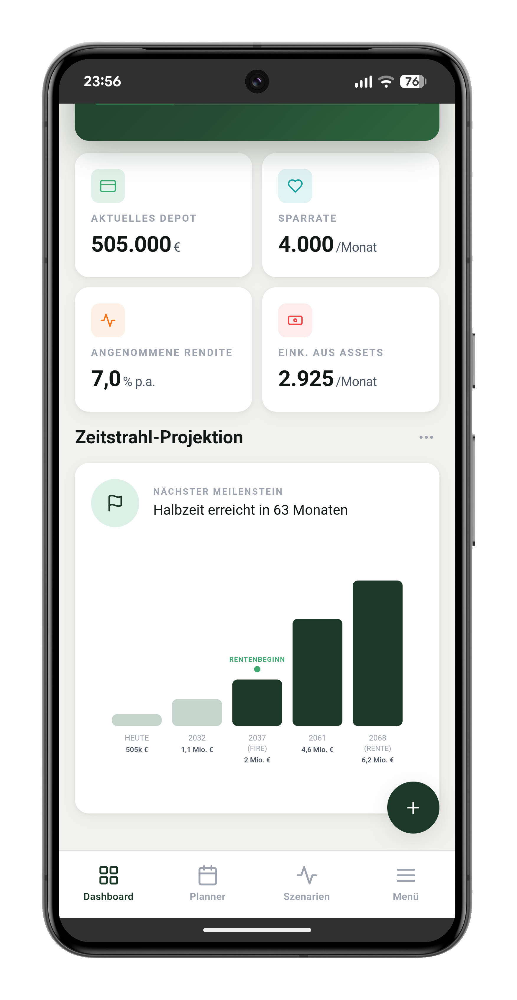
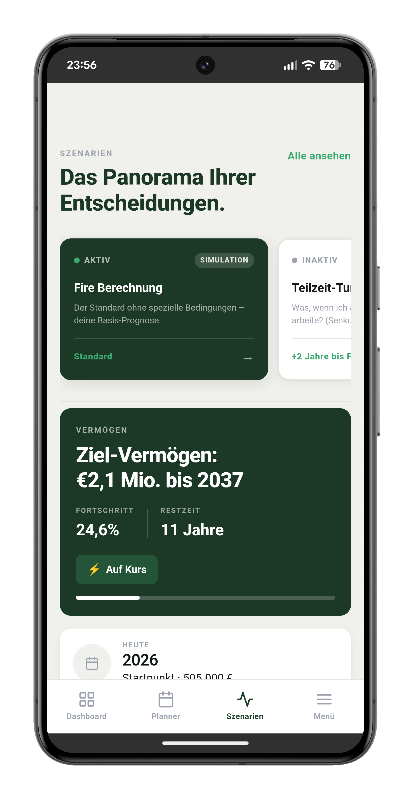
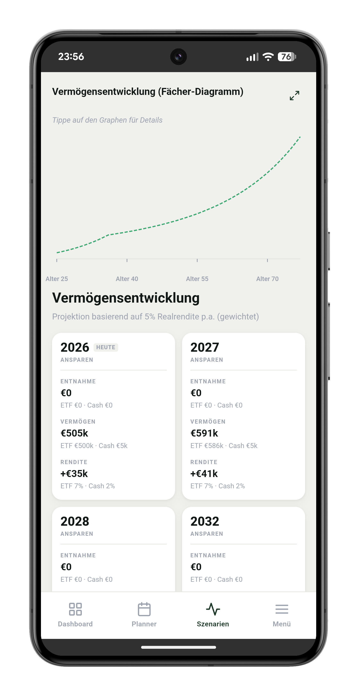
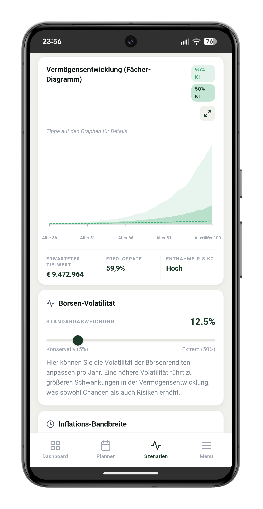

# Fire Rechner – FIRE Calculator
Last Dependencies update: 04.2026
Last Edit: 04.2026 <br>
Language: Typescript React Capacitor with Vite<br>
[](https://sonarcloud.io/summary/new_code?id=ChristianScheub_Typescript_Capacitor_GermanFireCalculator)
[](https://sonarcloud.io/summary/new_code?id=ChristianScheub_Typescript_Capacitor_GermanFireCalculator)
[](https://sonarcloud.io/summary/new_code?id=ChristianScheub_Typescript_Capacitor_GermanFireCalculator)
[](https://sonarcloud.io/summary/new_code?id=ChristianScheub_Typescript_Capacitor_GermanFireCalculator)

[](https://sonarcloud.io/summary/new_code?id=ChristianScheub_Typescript_Capacitor_GermanFireCalculator)
[](https://sonarcloud.io/summary/new_code?id=ChristianScheub_Typescript_Capacitor_GermanFireCalculator)
[](https://sonarcloud.io/summary/new_code?id=ChristianScheub_Typescript_Capacitor_GermanFireCalculator)
[](https://sonarcloud.io/summary/new_code?id=ChristianScheub_Typescript_Capacitor_GermanFireCalculator)
[](https://sonarcloud.io/summary/new_code?id=ChristianScheub_Typescript_Capacitor_GermanFireCalculator)

Fire Rechner is a practical app for calculating your path to financial independence (FIRE – Financial Independence, Retire Early). Enter your savings rate, current portfolio value, expected returns, and pension details to see when you can reach financial freedom. Includes Monte Carlo simulations, scenario planning, and a detailed dashboard.

Google Play Store: https://play.google.com/store/apps/details?id=de.scheub.fireCalculator

Apple App Store: https://apps.apple.com/de/app/fire-rechner/id6739471935

Deutsche Kurzbeschreibung: Fire Rechner ist eine praktische App zur Berechnung des eigenen Weges zur finanziellen Unabhängigkeit (FIRE – Financial Independence, Retire Early). Sparrate, aktuelles Depot, erwartete Rendite und Rentendaten eingeben und sehen, wann finanzielle Freiheit erreichbar ist – inklusive Monte-Carlo-Simulation, Szenarien und übersichtlichem Dashboard.

## App Screenshots

| Dashboard | Finanz-Check | Prognose |
| --------- | ------------ | -------- |
|  |  |  |

| Monte Carlo | Szenarien | Menü |
| ----------- | --------- | ---- |
|  |  |  |

## Architecture

The components are divided into four categories:

- `UI-Elements`
- `View-Components`
- `Container-Components`
- `ServiceLayer`

Note: Some modules are shared with other web apps, such as the UsedLibs module or the Impressum/Imprint modules.
As a result of using these modules there is one central configuration file:

- `app_texts`: Contains texts such as the description, imprint text, data protection text, etc.

`UI-Elements`
At the topmost level, UI-Elements are the fundamental building blocks of the interface. These are the atomic components that include buttons, input fields, cards, and other basic interactive elements. They are styled and abstracted to be reusable across the application.

`View-Components`
View-Components are composed of UI-Elements and form parts of the application's screens. They are responsible for presenting data and handling user interactions. These components are reusable within different parts of the application and communicate with Container-Components for dynamic data.

`Container-Components`
Container-Components serve as the data-fetching and state management layer. They connect View-Components to the Service Layer, managing application state and providing data to the components. They handle complex user interactions, form submissions, and communicate with services.

`Service Layer`
The Service Layer is the foundation of the application's client-side architecture. It includes the calculation engine for FIRE projections, Monte Carlo simulations, the logger service, and generic helper methods/hooks.

## Testing

The Vitest testing framework is used in combination with React Testing Library.
All tests are written in TypeScript and follow best practices for unit and integration testing.

### Running Tests

```bash
# Run all tests
npm test

# Run tests in watch mode
npm run test:watch

# Generate coverage report
npm run test:coverage
```

The coverage report is generated in the `coverage/` directory and includes:
- HTML report: `coverage/lcov-report/index.html`
- JSON summary: `coverage/coverage-summary.json`
- LCOV format: `coverage/lcov.info`

### Continuous Integration & Code Quality

#### GitHub Actions

All workflows are triggered on `v*` tags (and manually via `workflow_dispatch`):

| Workflow | File | Description |
|---|---|---|
| Deploy to GitHub Pages | `.github/workflows/deploy-to-githubsite.yml` | Builds the web app and deploys it to GitHub Pages |
| Android Build & GitHub Release | `.github/workflows/release-to-github.yml` | Builds the signed Android APK and creates a GitHub Release |
| Build, Sign & Deploy to Google Play | `.github/workflows/release-and-play-store.yml` | Builds, signs and uploads the AAB to Google Play Store |
| iOS Build & TestFlight | `.github/workflows/release-ios.yml` | Builds the iOS IPA, uploads to TestFlight via App Store Connect |

#### SonarCloud Integration

The project uses SonarCloud for automated code quality analysis and test coverage tracking. The integration is configured via:

- **Configuration File**: `sonar-project.properties` – Defines SonarCloud settings including coverage paths and exclusions
- **GitHub Actions**: Automatically runs tests and uploads coverage on every push and pull request

**View the full analysis:** [SonarCloud Dashboard](https://sonarcloud.io/summary/new_code?id=ChristianScheub_Typescript_Capacitor_GermanFireCalculator)

#### Pre-Build Architecture Checkers (Anti-AI-Slop Guards)

Before every production build (`npm run build`), a suite of static analysis scripts runs to enforce architectural rules and prevent AI-generated code from silently violating the project's layered structure. All checkers are located in `scripts/` and are orchestrated by `workflowAutomation.js`.

| Checker | File | What it enforces |
|---|---|---|
| **Service Components Checker** | `scripts/serviceComponentsChecker.js` | Modular Facade Service Architecture: each service must have `index.ts`, `I*Service.ts`, and a `logic/` subfolder; no imports from UI/components/views; max 2 exports per logic file; unused-export detection |
| **Code Quality Checker** | `scripts/codeQualityChecker.js` | No magic numbers; no `console.log` (use Logger); no inline style tags; folder structure limits; types only inside `types/` folders |
| **Container Components Checker** | `scripts/containerComponentsChecker.js` | Containers must not import UI components directly; no raw `input`/`button` HTML tags; tag-count limits; naming conventions |
| **View & UI Components Checker** | `scripts/viewUIComponentsChecker.js` | Views and UI components must not import services or state-management directly; naming conventions |

The build fails with a clear violation list if any rule is broken, making it impossible to accidentally ship code that breaks the architecture – regardless of whether the code was written by a human or an AI assistant.

## Available Scripts

### `npm run dev`
Runs the app in development mode.
Open [http://localhost:5173](http://localhost:5173) to view it in the browser.

### `npm run build`
Builds the app for production to the `dist` folder.
Bundles React in production mode and optimizes the build for the best performance.

### `npx license-checker --json --production --out licenses.json`
Generates the JSON with the licenses of the NPM packages used. This can replace the existing license JSON under `src/legal/usedLibs/`.

## Expanding the ESLint configuration

If you are developing a production application, we recommend updating the configuration to enable type-aware lint rules:

```js
export default defineConfig([
  globalIgnores(['dist']),
  {
    files: ['**/*.{ts,tsx}'],
    extends: [
      tseslint.configs.recommendedTypeChecked,
      tseslint.configs.strictTypeChecked,
      tseslint.configs.stylisticTypeChecked,
    ],
    languageOptions: {
      parserOptions: {
        project: ['./tsconfig.node.json', './tsconfig.app.json'],
        tsconfigRootDir: import.meta.dirname,
      },
    },
  },
])
```

You can also install [eslint-plugin-react-x](https://github.com/Rel1cx/eslint-react/tree/main/packages/plugins/eslint-plugin-react-x) and [eslint-plugin-react-dom](https://github.com/Rel1cx/eslint-react/tree/main/packages/plugins/eslint-plugin-react-dom) for React-specific lint rules:

```js
// eslint.config.js
import reactX from 'eslint-plugin-react-x'
import reactDom from 'eslint-plugin-react-dom'

export default defineConfig([
  globalIgnores(['dist']),
  {
    files: ['**/*.{ts,tsx}'],
    extends: [
      reactX.configs['recommended-typescript'],
      reactDom.configs.recommended,
    ],
    languageOptions: {
      parserOptions: {
        project: ['./tsconfig.node.json', './tsconfig.app.json'],
        tsconfigRootDir: import.meta.dirname,
      },
    },
  },
])
```

## Used NPM Modules
According to the command `npm list` you can see the deeper NPM modules used and which of these are used in the `licenses.json`.

<br /> ├── @capacitor-community/admob@8.0.0
<br /> ├── @capacitor/android@8.3.0
<br /> ├── @capacitor/cli@8.3.0
<br /> ├── @capacitor/core@8.3.0
<br /> ├── @capacitor/ios@8.3.0
<br /> ├── @capacitor/share@8.0.1
<br /> ├── @eslint/js@9.39.4
<br /> ├── @types/jest@30.0.0
<br /> ├── @types/node@24.12.2
<br /> ├── @types/react-dom@19.2.3
<br /> ├── @types/react@19.2.14
<br /> ├── @vitejs/plugin-react@6.0.1
<br /> ├── @vitest/coverage-v8@3.2.4
<br /> ├── eslint-plugin-react-hooks@7.0.1
<br /> ├── eslint-plugin-react-refresh@0.5.2
<br /> ├── eslint@9.39.4
<br /> ├── globals@17.4.0
<br /> ├── i18next-browser-languagedetector@8.2.1
<br /> ├── i18next@26.0.3
<br /> ├── jsdom@27.0.1
<br /> ├── license-checker@25.0.1
<br /> ├── react-dom@19.2.4
<br /> ├── react-i18next@17.0.2
<br /> ├── react@19.2.4
<br /> ├── typescript-eslint@8.58.0
<br /> ├── typescript@6.0.2
<br /> ├── vite@8.0.8
<br /> └── vitest@3.2.4